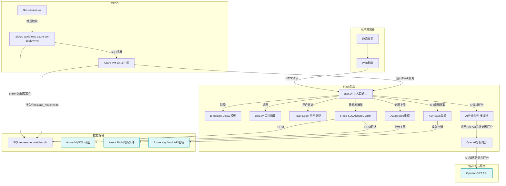

# Candidate Screening and Matching System 系统架构图

---

**说明：**
- 用户通过浏览器访问 Flask 后端，前端页面由 Jinja2 模板渲染，静态资源由 static 提供。
- Flask 后端负责路由、业务逻辑、用户认证、数据库操作、AI分析队列、多线程、与 Azure Key Vault 及 Blob 的集成。
- AI分析队列会调用OpenAI GPT API进行简历内容分析和自动评分，分析结果回写数据库。
- 数据存储支持本地 SQLite 和 Azure MySQL，简历文件可上传至 Azure Blob，API Key 等敏感信息集中存储于 Azure Key Vault。
- CI CD 采用 GitHub Actions 自动部署，推送到 main 分支后自动构建、上传、重启服务，并确保 resume_matcher.db 文件属主为 bingo。
- 主要依赖见 requirements.txt，包括 Flask、SQLAlchemy、Login、openai、PyPDF2、python-docx、azure 相关库等。 